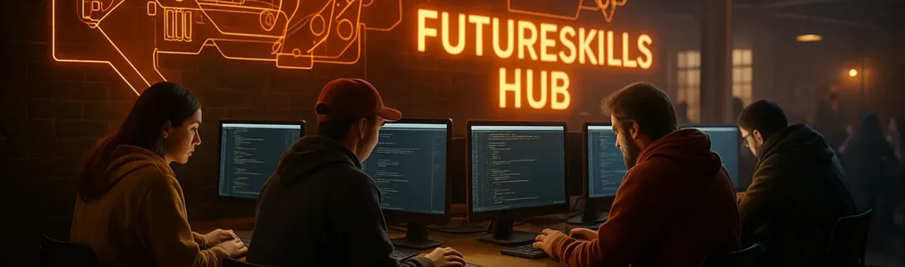
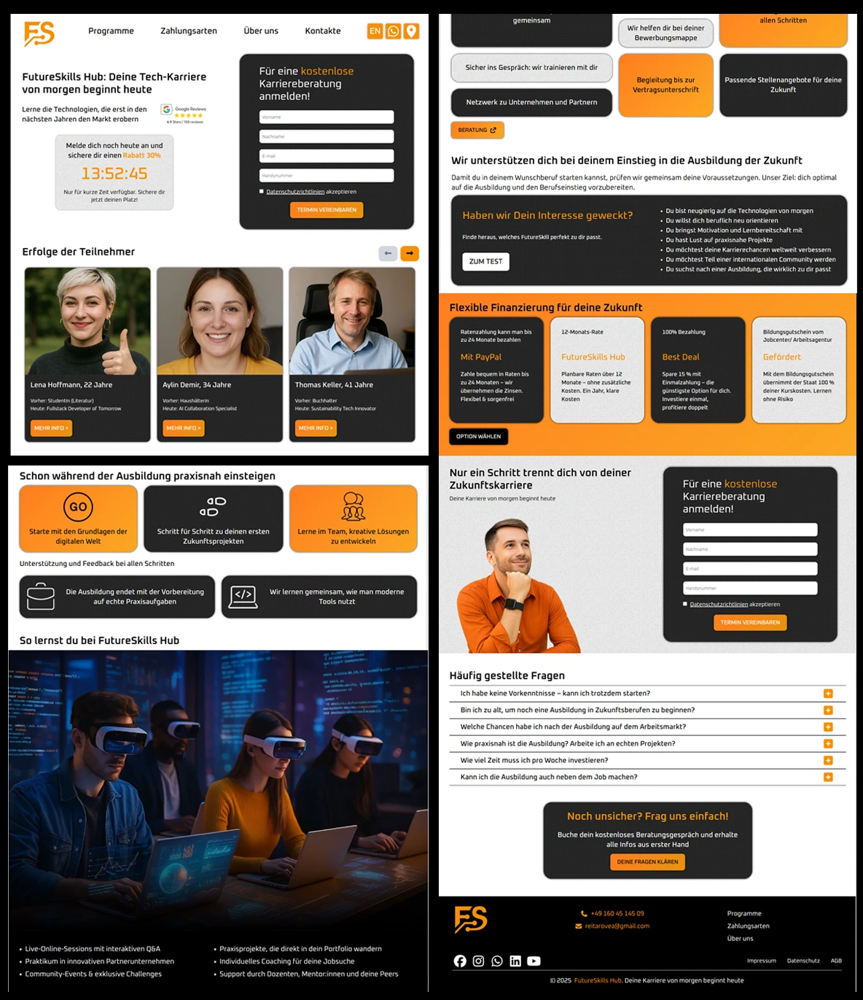
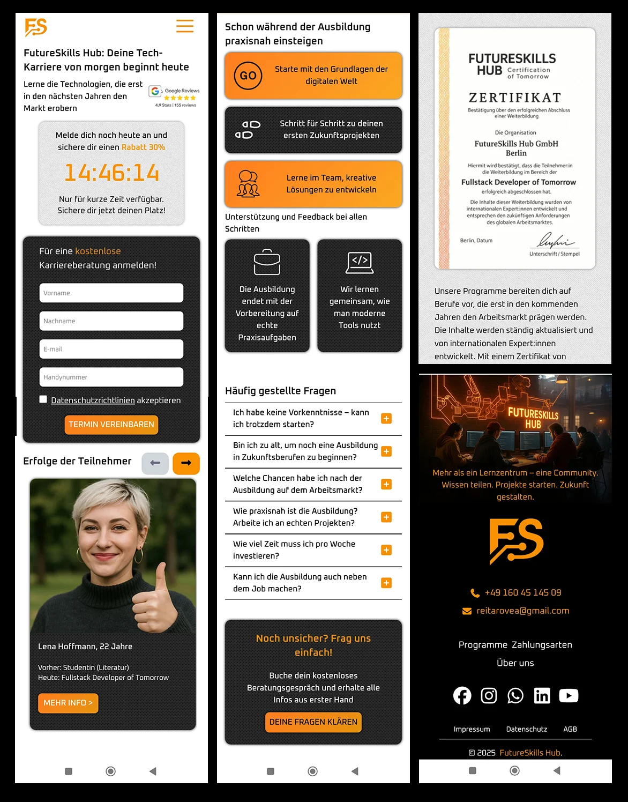
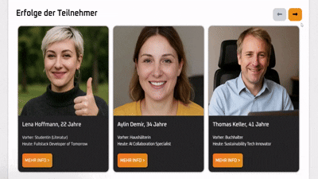

<p align="center">
  
</p>

<h1 align="center">⚡ FutureSkills Hub Landing (React + Tailwind)</h1>

<p align="center">
  <em>Eine moderne React-Landingpage mit Mehrsprachigkeit, Formularlogik und responsivem UI – entwickelt für den FutureSkills Hub.</em>
</p>

---


---

## ✨ Überblick
> Diese Landingpage wurde entwickelt, um Interessenten über moderne Tech-Ausbildungen zu informieren  
> und eine einfache Terminvereinbarung für Karriereberatung zu ermöglichen.  

**FutureSkills Hub** ist eine vollständig responsive Landingpage, erstellt mit **React 18 + Tailwind CSS** auf Basis eines eigenen Figma-Designs.  
Das Projekt demonstriert praxisorientierte Kenntnisse in **Komponentenarchitektur, Mehrsprachigkeit, Formularvalidierung, Modals** und **API-Integration**.  

---

## 🌍 Live-Demo  
🔗 <a href="https://magic-landing-seven.vercel.app" target="_blank">https://magic-landing-seven.vercel.app</a>

---

## 🎨 Design → Code  
Die Website wurde exakt nach einem eigenen Figma-Layout umgesetzt.

- 🎨 <a href="https://www.figma.com/proto/gEYP2Ff7j1c2Hia4MkVdkO/Untitled?node-id=0-1&t=yjzE33JsR1OeIi2R-1" target="_blank">Figma-Design ansehen</a>  
- 

---

## 🎥 Projekt-Preview  

<h3 align="center">💻 Desktop & 📱 Mobile Preview</h3>

<p align="center">
  
  
</p>


<h3 align="center">🎞️ Slider Animation</h3>
<p align="center">
  
</p>

<p align="center">
  <em>(Zeigt Scroll, Sprachwechsel, Modal und Formularversand.)</em>
</p>

---

## 🧩 Tech Stack  
  
  
  


- **React 18** – komponentenbasierte Struktur  
- **React Router DOM** – Routing & Navigation  
- **Tailwind CSS 4.0** – Utility-First Styling  
- **Web3Forms API** – Formularversand  
- **Vite** – Build-Tool  
- **i18n** – Mehrsprachigkeit (Deutsch / Englisch)  

---

## 🚀 Hauptfunktionen  
- 🌐 **Sprachumschaltung** (DE / EN)  
- 🕐 **Countdown-Timer** bis Mitternacht  
- 💬 **Modale Fenster** (Registrierung, Cookies)  
- 📬 **Formularvalidierung** + Versand via API  
- 📱 **100 % Responsive Design** (Mobile-First)  
- ⚡ **Tailwind-Utilities** & Custom-Klassen  
- 🧠 **Saubere Komponentenstruktur**

---

## ⚙️ Installation
```bash
git clone https://github.com/TAURUS-ESSEN/magicLanding.git
cd magicLanding
npm install
npm run dev
```

---

## 👤 Autor

Yevhen Reitarov 

📧 <a href="mailto:reitarovea@gmail.com" target="_blank">reitarovea@gmail.com
</a>

---

## 📜 Lizenz

Dieses Projekt wurde zu Lern- und Demonstrationszwecken erstellt.
Alle verwendeten Bilder und Texte dienen ausschließlich der Präsentation.

<p align="center"> <sub>© 2025 FutureSkills Hub – erstellt von <strong>Yevhen Reitarov</strong></sub><br/> <a href="https://magic-landing-seven.vercel.app" target="_blank">🌐 Live-Demo ansehen</a> </p>
