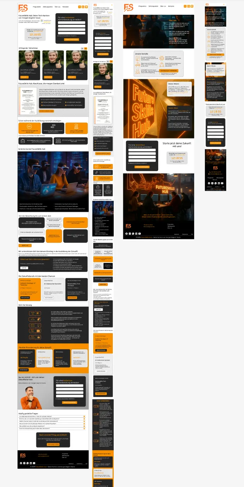
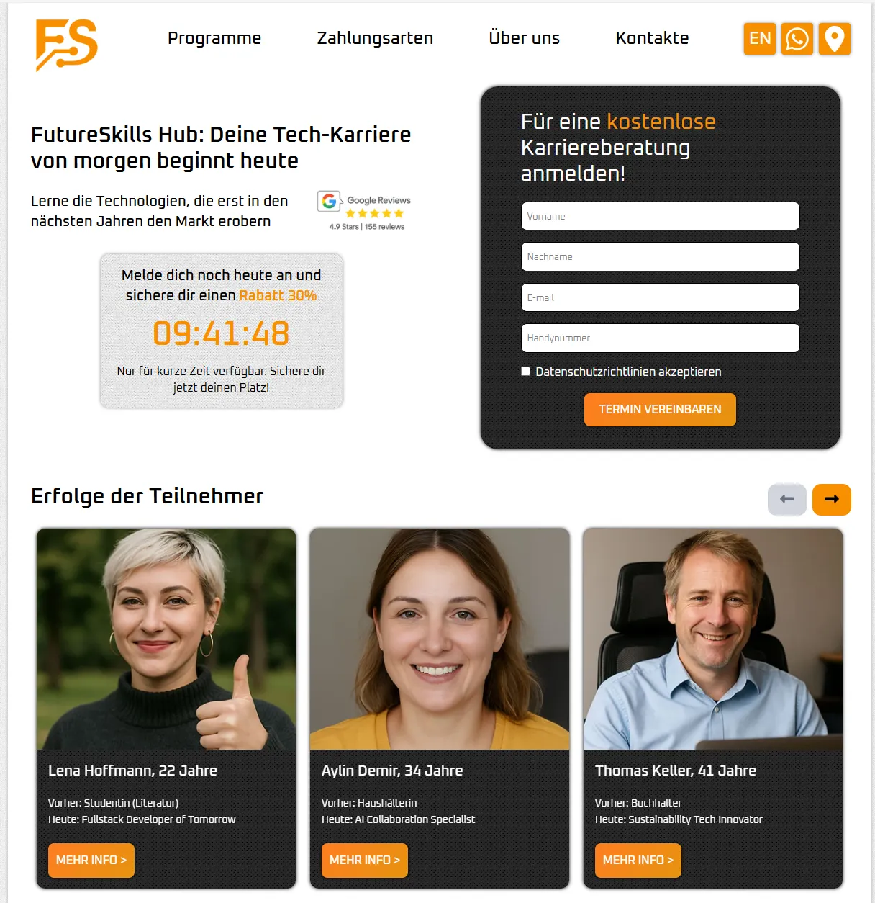

# ⚡ FutureSkills Hub Landing (React + Tailwind)

**FutureSkills Hub** ist eine moderne, vollständig responsive Landingpage, entwickelt mit **React 18 + Tailwind CSS** auf Basis eines eigenen Figma-Designs.  
Das Projekt demonstriert praxisorientierte Kenntnisse in **Komponentenarchitektur, Mehrsprachigkeit, Formularvalidierung, Modals** und **API-Integration**.

---

## 🌍 Live-Demo  
🔗 <a href="https://magic-landing-seven.vercel.app" target="_blank">https://magic-landing-seven.vercel.app</a>

---

## 🎨 Design → Code  
Die Website wurde exakt nach einem eigenen Figma-Layout umgesetzt.

- 🎨 <a href="https://www.figma.com/proto/gEYP2Ff7j1c2Hia4MkVdkO/Untitled?node-id=0-1&t=yjzE33JsR1OeIi2R-1" target="_blank">Figma-Design ansehen</a>  
- 

🖼️ Vergleich zwischen Figma-Layout und der finalen Umsetzung:

| Figma-Layout | Umsetzung |
|--------------|------------|
|  |  |
---

## 🎥 Projekt-Preview  

| Desktop Demo | Mobile Demo |
|---------------|--------------|
|  |
|  |

*(Zeigt Scroll, Sprachwechsel, Modal und Formularversand.)*

---

## 🧩 Tech Stack  
  
  
  

- **React 18** – komponentenbasierte Struktur  
- **React Router DOM** – Routing & Navigation  
- **Tailwind CSS 4.0** – Utility-First Styling  
- **Web3Forms API** – Formularversand  
- **Vite** – Build-Tool  
- **i18n** – Mehrsprachigkeit (Deutsch / Englisch)

---

## 🚀 Hauptfunktionen  
- 🌐 **Sprachumschaltung** (DE / EN)  
- 🕐 **Countdown-Timer** bis Mitternacht  
- 💬 **Modale Fenster** (Registrierung, Cookies)  
- 📬 **Formularvalidierung** + Versand via API  
- 📱 **100 % Responsive Design** (Mobile-First)  
- ⚡ **Tailwind-Utilities** & Custom-Klassen  
- 🧠 **Saubere Komponentenstruktur**

---

## 📂 Projektstruktur  
